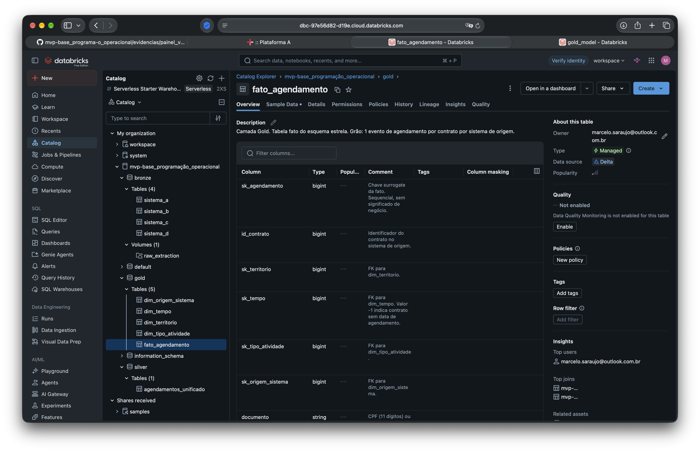
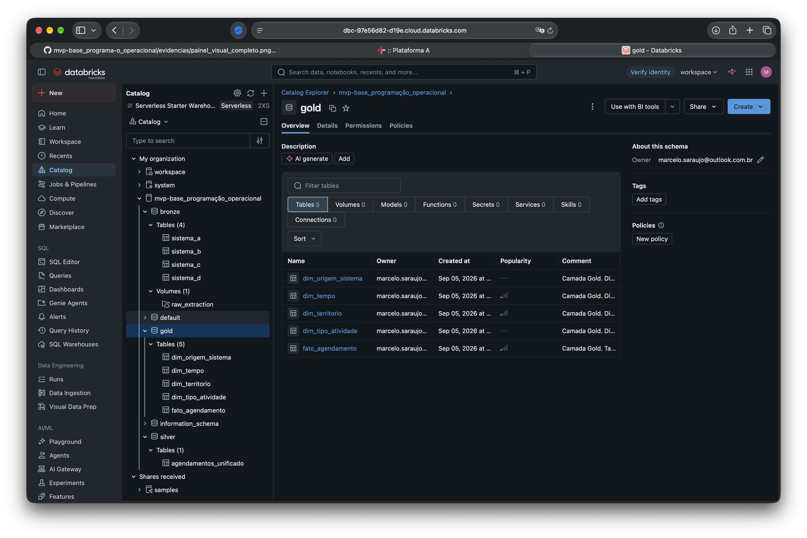
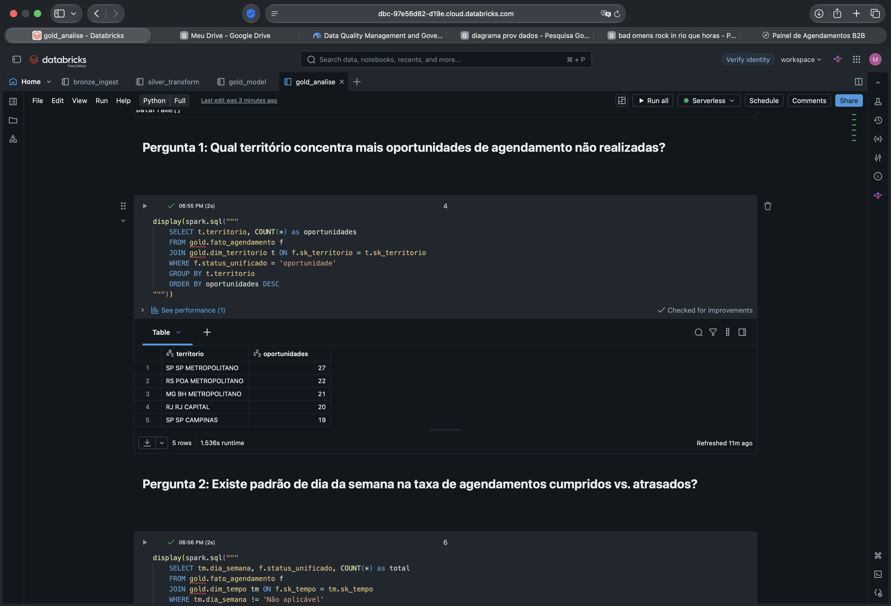
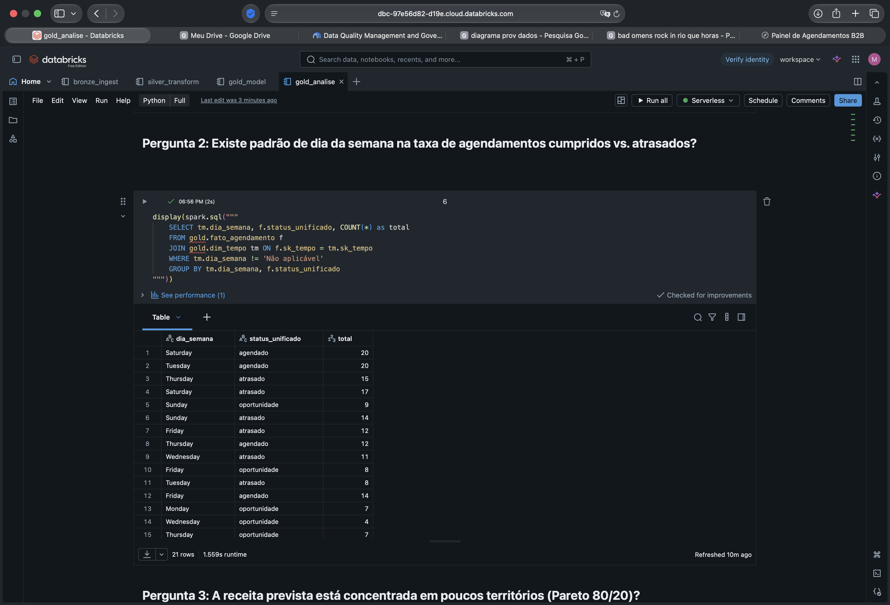
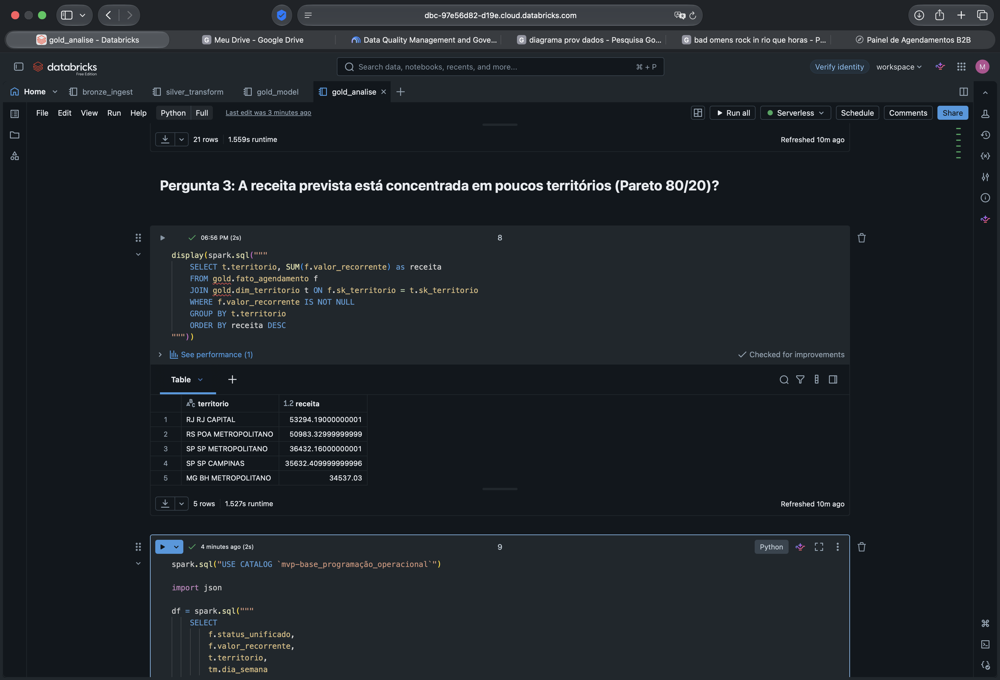
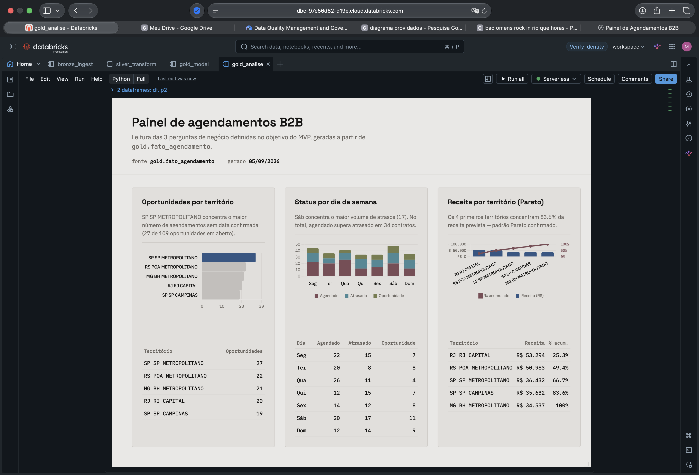

# MVP — Pipeline de Agendamentos B2B (dados anonimizados)

**Desenvolvido por:** Marcelo Santos Araujo
**Matrícula:** 4052024002227
**Curso:** Especialização em Ciência de Dados e Analytics — PUC-Rio
**Disciplina:** Engenharia de Dados
**Data:** 26/09/2026
**Plataforma:** Databricks Free Edition (Unity Catalog + Delta Lake)

> Nomenclatura anonimizada usada neste documento: a empresa é referida como
> "Operadora X" e os 4 sistemas de origem como **Sistema A** (CRM padrão,
> cobre a maior parte do território), **Sistema B** (CRM regional 1),
> **Sistema C** (CRM regional 2) e **Sistema D** (planilha de varejo).
> Nenhum nome de cliente, contrato, documento ou valor real aparece neste
> repositório — os dados são sintéticos.

### Estrutura do repositório

```
├── README.md
├── notebooks/
│   ├── bronze_ingest.ipynb      # ingestão bruta (Bronze)
│   ├── silver_transform.ipynb   # limpeza e padronização (Silver)
│   ├── gold_model.ipynb         # modelagem dimensional + catálogo (Gold)
│   └── gold_analise.ipynb       # respostas às perguntas de negócio
├── scripts/
│   └── gerar_dados_sinteticos.py  # gera os 4 arquivos brutos anonimizados
└── evidencias/                  # screenshots citados neste documento
```

---

## Contexto de Negócio e Perguntas (Etapa 2 e 4.1)

### Problema

A Operadora X registra agendamentos de instalação e vistoria de serviços
B2B em 4 sistemas regionais diferentes, sem visão unificada. Cada sistema
usa nomes de coluna, grafias de território e vocabulário de status
próprios. Isso impede responder, de forma confiável e num único lugar,
quanto está agendado, quanto está atrasado, onde estão as oportunidades
de agendamento e quanta receita está em jogo em cada território.

O objetivo do MVP é construir um pipeline que consolide esses 4 sistemas
numa base única, limpa e modelada, capaz de responder às perguntas abaixo.

### Perguntas de negócio

1. Qual território concentra mais oportunidades de agendamento não realizadas?
2. Existe padrão de dia da semana ou período (manhã/tarde) na taxa de
   agendamentos cumpridos vs. atrasados?
3. A receita prevista em agenda está concentrada em poucos territórios
   (Pareto 80/20)?

### Dados brutos

| Arquivo | Sistema | Linhas | Colunas originais |
|---|---|---|---|
| `sistema_a.csv` | A — CRM padrão | 112 | NUM_CONTRATO, CNPJ_CPF, TERRITORIO, TIPO_PENDENCIA, DATA_AGENDAMENTO, VALOR_RECORRENTE, TIPO_ATIVIDADE |
| `sistema_b.xlsx` (aba `data`) | B — CRM regional 1 | 102 | ID_CONTRATO, DOCUMENTO, CLUSTER, SERVICO_ABERTURA, STATUS, DATA_ABERTURA, PERIODO |
| `sistema_c_relatorio(9011).xlsx` | C — CRM regional 2 | 117 | Contrato, CNPJ, Territorio_Atend, Tipo Atendimento, Servico, Tecnologia, Situacao_OS, Data_Agenda |
| `sistema_d.xlsx` | D — planilha de varejo | 104 | Numero_Contrato, UF, Cluster_Varejo, Status, Data_Agendamento |

Total: 435 registros. Os mesmos conceitos (contrato, território, status,
data, tipo de atividade) aparecem com nomes e formatos diferentes em cada
sistema — esse é o problema central que o pipeline resolve.

### Origem e licença

Os dados reproduzem a estrutura real de exports de CRM com que trabalho,
mas **todo o conteúdo é sintético**, gerado pelo script
`scripts/gerar_dados_sinteticos.py` (semente fixa, reprodutível). A opção
segue a orientação do edital para dados empresariais: anonimizar
informações sensíveis antes de subir a qualquer ambiente externo.

Não há licença de terceiros aplicável: não são dados abertos nem de
nenhum repositório público. O uso é exclusivamente acadêmico.

---

## Carga dos Dados (Etapa 4.2)

Os 4 arquivos brutos foram carregados por upload manual no **Volume
`raw_extraction`**, criado dentro do schema `bronze` do Unity Catalog
(`/Volumes/<catalogo>/bronze/raw_extraction/`). Essa etapa não envolve
transformação: o Volume funciona como área de pouso dos arquivos no
formato em que chegaram.

A ingestão é feita pelo notebook **`notebooks/bronze_ingest.ipynb`**, que:

1. Lê os 4 arquivos do Volume com `pandas` (`pd.read_csv` / `pd.read_excel`).
2. Adiciona metadados de controle a cada registro: `_data_ingestao` e
   `_arquivo_origem`.
3. Ajusta nomes de coluna incompatíveis com o formato Delta (espaços e
   parênteses), sem alterar nenhum valor.
4. Persiste cada sistema como tabela Delta: `bronze.sistema_a`,
   `bronze.sistema_b`, `bronze.sistema_c`, `bronze.sistema_d`.

Não houve scraping nem chamada de API: os dados de origem já vêm como
arquivo, simulando exports de CRM.

---

## Modelagem e Catálogo de Dados (Etapa 4.3)

### Derivação das dimensões — heurística 5W1H

| Pergunta | Resposta | Resultado no modelo |
|---|---|---|
| **Quando** o evento ocorre? | Data do agendamento | `dim_tempo` |
| **Onde** o serviço será prestado? | Território | `dim_territorio` |
| **O quê** está sendo agendado? | Tipo de atividade (instalação/vistoria) | `dim_tipo_atividade` |
| **De onde** vem o registro? | Sistema de origem (A/B/C/D) | `dim_origem_sistema` |
| **Como** está o agendamento? | Status (agendado/atrasado/oportunidade) | atributo na própria fato (`status_unificado`), por ter só 3 valores |
| **Quem** é o responsável? | Gestor/equipe comercial | não modelado: nenhuma das 4 fontes traz essa informação |

### Granularidade

> **1 linha da tabela fato = 1 registro de agendamento de um contrato em
> um sistema de origem.** Se o mesmo contrato aparece em mais de um
> sistema, gera mais de uma linha; a replicação é sinalizada por
> `flag_replicado_multissistema`, não removida.

### Escolha do esquema: Estrela (Star Schema)

Há um único fato central (agendamento) e as dimensões são pequenas (2 a
56 linhas). Normalizá-las em sub-tabelas (Snowflake) acrescentaria joins
sem ganho real. O esquema estrela prioriza consultas simples e diretas
para as perguntas de negócio.

```
                  dim_tempo
                      │
dim_territorio ── fato_agendamento ── dim_tipo_atividade
                      │
              dim_origem_sistema
```

### Chaves surrogate e linhas sentinela

Todas as dimensões usam chave surrogate sequencial (`sk_*`), sem
significado de negócio. Quando um fato não tem valor para uma dimensão,
em vez de deixar a chave estrangeira nula, ele aponta para uma **linha
sentinela com chave `-1`**:

- `dim_tempo`, `sk_tempo = -1` ("Não aplicável"): 163 registros sem data.
- `dim_tipo_atividade`, `sk_tipo_atividade = -1` ("Não informado"): os
  104 registros do Sistema D, que não informa tipo de atividade.

### Estrutura das tabelas (camada Gold)

**`gold.fato_agendamento`** — 435 linhas

| Coluna | Tipo | Domínio |
|---|---|---|
| sk_agendamento | bigint | chave surrogate, 1 a 435 |
| id_contrato | bigint | identificador do contrato no sistema de origem |
| sk_territorio | bigint | FK → dim_territorio |
| sk_tempo | bigint | FK → dim_tempo; -1 = sem data |
| sk_tipo_atividade | bigint | FK → dim_tipo_atividade; -1 = não informado |
| sk_origem_sistema | bigint | FK → dim_origem_sistema |
| documento | string | CPF (11 dígitos) ou CNPJ (14 dígitos), sintético; nulo no Sistema D |
| tipo_documento | string | {PF, PJ}; nulo no Sistema D |
| status_unificado | string | {agendado, atrasado, oportunidade} |
| valor_recorrente | double | valor em R$; preenchido apenas no Sistema A |
| flag_replicado_multissistema | boolean | True em 58 das 435 linhas |

**`gold.dim_territorio`** — 5 linhas

| Coluna | Tipo | Domínio |
|---|---|---|
| sk_territorio | bigint | 1 a 5 |
| territorio | string | SP SP METROPOLITANO, SP SP CAMPINAS, RJ RJ CAPITAL, MG BH METROPOLITANO, RS POA METROPOLITANO |

**`gold.dim_tipo_atividade`** — 3 linhas

| Coluna | Tipo | Domínio |
|---|---|---|
| sk_tipo_atividade | bigint | 1, 2 e -1 (sentinela) |
| tipo_atividade | string | instalação, vistoria, Não informado |

**`gold.dim_origem_sistema`** — 4 linhas

| Coluna | Tipo | Domínio |
|---|---|---|
| sk_origem_sistema | bigint | 1 a 4 |
| sistema_origem | string | {A, B, C, D} |

**`gold.dim_tempo`** — 56 linhas (55 datas + 1 sentinela)

| Coluna | Tipo | Domínio |
|---|---|---|
| sk_tempo | bigint | 1 a 55 e -1 (sentinela) |
| data_agendamento | timestamp | datas entre jul e set/2026; nulo na sentinela |
| ano | numérico | ano da data; nulo na sentinela |
| mes | numérico | 1 a 12; nulo na sentinela |
| dia_semana | string | Monday a Sunday; "Não aplicável" na sentinela |

### Dados de referência × dados-mestre (DMBOK)

- **Dados de referência**, usados para classificar: territórios válidos,
  tipos de atividade, domínio de status e os dicionários de-para.
- **Dados-mestre**, que representam entidades do negócio: contrato,
  cliente (documento) e sistema de origem.

### Catálogo de dados no Unity Catalog

A documentação não ficou só neste README: a última célula do
`gold_model` grava **descrição em todas as 10 tabelas (Bronze, Silver e
Gold) e em 22 colunas da camada Gold** diretamente no Unity Catalog, via
`COMMENT ON TABLE` e `ALTER TABLE ... ALTER COLUMN ... COMMENT`. Assim o
catálogo é gerado por código e se mantém a cada reprocessamento.



*Unity Catalog exibindo a descrição de `gold.fato_agendamento` e, para
cada coluna, tipo e comentário com domínio e linhagem.*

### Dicionário de dados

**gold.fato_agendamento**

| Campo | Preenchimento |
|---|---|
| Descrição | Um registro por agendamento de instalação/vistoria B2B, por sistema de origem |
| Chaves | PK: sk_agendamento. FKs: sk_territorio, sk_tempo, sk_tipo_atividade, sk_origem_sistema |
| Granularidade | 1 registro de agendamento de 1 contrato em 1 sistema de origem |
| Temporalidade | Snapshot único; reprocessado em 26/09/2026; sem histórico de versões |
| Origem | Sistemas A, B, C e D, via bronze_ingest → silver_transform → gold_model |
| Transformações | Normalização de território, status e tipo de atividade; classificação PF/PJ; marcação de replicação; documento convertido para texto; chaves sentinela |
| Licença | Dado sintético, uso acadêmico, sem licença de terceiros |

**gold.dim_territorio**

| Campo | Preenchimento |
|---|---|
| Descrição | Territórios de atendimento válidos (dado de referência) |
| Granularidade | 1 linha por território |
| Origem | Valores únicos de `territorio_normalizado` na Silver |
| Transformações | De-para de 16 grafias para 5 territórios; deduplicação |

**gold.dim_tipo_atividade**

| Campo | Preenchimento |
|---|---|
| Descrição | Tipo de atividade agendada (dado de referência) |
| Granularidade | 1 linha por tipo, mais 1 sentinela |
| Origem | Valores únicos de `tipo_atividade_normalizado` na Silver |
| Transformações | De-para de 6 rótulos originais para 2 conceitos; linha sentinela -1 para o Sistema D |

**gold.dim_origem_sistema**

| Campo | Preenchimento |
|---|---|
| Descrição | Sistema/CRM de origem do registro (dado-mestre) |
| Granularidade | 1 linha por sistema |
| Origem | Atribuído na leitura de cada arquivo |

**gold.dim_tempo**

| Campo | Preenchimento |
|---|---|
| Descrição | Datas de agendamento distintas, decompostas em ano, mês e dia da semana |
| Granularidade | 1 linha por data, mais 1 sentinela |
| Temporalidade | Intervalo presente na amostra (jul a set/2026) |
| Origem | Valores únicos de `data_agendamento` na Silver |
| Transformações | Padronização para `AAAA-MM-DD`; decomposição temporal; linha sentinela -1 |

---

## Pipeline de Dados (Etapa 4.4)

### Organização: um notebook por camada

O pipeline foi ramificado em **4 notebooks**, cada um responsável por uma
transição da Arquitetura Medalhão:

| Notebook | Responsabilidade | Lê de | Grava em |
|---|---|---|---|
| [`bronze_ingest`](notebooks/bronze_ingest.ipynb) | Ingestão bruta + metadados de controle | Volume `raw_extraction` | `bronze.sistema_a/b/c/d` |
| [`silver_transform`](notebooks/silver_transform.ipynb) | Limpeza, padronização e unificação dos 4 sistemas | `bronze.*` | `silver.agendamentos_unificado` |
| [`gold_model`](notebooks/gold_model.ipynb) | Modelo estrela, chaves surrogate, sentinelas e comentários do catálogo | `silver.agendamentos_unificado` | `gold.fato_agendamento`, `gold.dim_*` |
| [`gold_analise`](notebooks/gold_analise.ipynb) | Respostas às perguntas via SQL + painel visual | `gold.*` | apenas exibição |

Separar por camada ajudou a isolar problemas: o erro de junção de datas
descrito na autoavaliação foi localizado e corrigido só no `gold_model`,
sem reprocessar Bronze nem Silver.

Cada notebook mantém sua própria sessão, então todos começam com
`USE CATALOG` e os imports necessários, e leem a camada anterior a partir
das tabelas persistidas — nunca de variáveis em memória de outro notebook.

### Evidência das tabelas persistidas



*Catalog Explorer com os schemas `bronze` (4 tabelas + Volume
`raw_extraction`), `silver` (1 tabela) e `gold` (fato + 4 dimensões). A
coluna Comment mostra as descrições gravadas pelo pipeline.*

### Transformações por etapa

**Bronze (`bronze_ingest`)** — nenhum valor de negócio é alterado. Só são
adicionados `_data_ingestao` e `_arquivo_origem`, e renomeadas colunas
que o Delta rejeita (ex: `Tipo Atendimento` → `Tipo_Atendimento`).

**Silver (`silver_transform`)**
- De-para de território: 16 grafias diferentes → 5 territórios.
- De-para de status: 11 rótulos → 3 status (agendado, atrasado, oportunidade).
- De-para de tipo de atividade: 6 rótulos → 2 (instalação, vistoria).
- Classificação PF/PJ pelo tamanho do documento.
- Renomeação das colunas dos 4 sistemas para um padrão único e união
  com `pd.concat`, preenchendo com nulo o que um sistema não coleta.
- Marcação de contratos presentes em mais de um sistema
  (`flag_replicado_multissistema`).

**Gold (`gold_model`)**
- Criação das 4 dimensões com chave surrogate.
- Junção da Silver com as dimensões para substituir texto por chaves.
- Linhas sentinela `-1` em `dim_tempo` e `dim_tipo_atividade`.
- Conversão de `documento` para texto e das chaves para inteiro.
- Gravação das descrições de tabelas e colunas no Unity Catalog.

### Linhagem (modelo PROV)

| Entidade origem | Atividade | Agente | Entidade resultante |
|---|---|---|---|
| 4 arquivos no Volume `raw_extraction` | ingestão sem alteração de valores + metadados | `bronze_ingest` | `bronze.sistema_a/b/c/d` |
| `bronze.sistema_a/b/c/d` | de-para de território, status e tipo de atividade; PF/PJ; unificação; marcação de replicação | `silver_transform` | `silver.agendamentos_unificado` |
| `silver.agendamentos_unificado` | modelagem estrela; chaves surrogate e sentinela; tipagem; comentários | `gold_model` | `gold.fato_agendamento` + 4 dimensões |
| `gold.*` | consultas SQL de negócio | `gold_analise` | gráficos e painel |

A aba Lineage do Unity Catalog não registra esse fluxo automaticamente,
porque os dados passam por `pandas` entre uma tabela e outra. Por isso a
linhagem está documentada manualmente acima e nos comentários das colunas.

---

## Qualidade de Dados (Etapa 4.5)

Cada atributo crítico foi verificado quanto a completude, consistência,
unicidade e acurácia. Os problemas abaixo foram observados nos dados e
tratados no pipeline.

| Atributo | Dimensão de qualidade | Problema encontrado | Tratamento | Camada |
|---|---|---|---|---|
| nomes de coluna | Consistência | `Tipo Atendimento` (Sistema C) rejeitada pelo Delta por conter espaço | espaço → underscore, parênteses removidos | Bronze |
| território | Consistência | 16 grafias para 5 territórios (ex: "SAO PAULO METRO", "sp metropolitano", "SP - Metropolitana"). A primeira versão do de-para deixou 5 variantes de fora | de-para ampliado até a verificação de "não mapeados" retornar vazio | Silver |
| status | Consistência | 11 rótulos diferentes entre os sistemas para 3 conceitos | de-para validado com verificação de "não mapeados" vazia nos 4 sistemas | Silver |
| status (Sistema D) | Acurácia | O Sistema D usa "PENDENTE" tanto para atrasado quanto para oportunidade. Não há como distinguir: as 104 linhas foram classificadas como atrasado e o Sistema D ficou sem nenhuma oportunidade | mantido como atrasado e registrado como limitação | Silver |
| tipo de atividade | Consistência / Completude | 6 rótulos para 2 conceitos; o Sistema D não informa o tipo (104 nulos) | de-para para 2 valores; nulos apontam para sentinela `-1` | Silver → Gold |
| documento | Consistência | Sistemas A e C só têm CNPJ; o B mistura CPF e CNPJ; o D não coleta | classificação PF/PJ por tamanho (11 ou 14 dígitos) | Silver |
| documento (tipo) | Consistência | Ao unir os sistemas, a coluna virou número decimal e passou a ser exibida em notação científica (`1.122334e+13`). O problema só ficou visível no print do catálogo | conversão explícita para texto antes da gravação | Gold |
| id_contrato | Unicidade | 58 das 435 linhas (13%) são contratos presentes em mais de um sistema, alguns em três | sinalizados com `flag_replicado_multissistema`, sem remoção | Silver |
| data de agendamento | Completude / Acurácia | 163 linhas sem data. Destas, 55 são oportunidade (esperado), mas **108 estão marcadas como agendado (47) ou atrasado (61) sem data**, o que é contraditório | todas apontam para `sk_tempo = -1`; as 108 inconsistentes ficam de fora da análise por dia da semana e estão registradas como limitação | Gold |
| valor recorrente | Completude | Só o Sistema A informa valor: 112 de 435 linhas (26%) | nenhum valor imputado; a análise de receita é explicitamente restrita ao Sistema A | Gold / Análise |
| período (manhã/tarde) | Completude | A coluna `PERIODO` existe só no Sistema B | descartada na Silver; a parte "período" da Pergunta 2 não foi respondida | Silver |

Distribuição de status versus presença de data, usada para dimensionar o
problema de completude:

| Status | Com data | Sem data | Total |
|---|---|---|---|
| agendado | 126 | 47 | 173 |
| atrasado | 92 | 61 | 153 |
| oportunidade | 54 | 55 | 109 |
| **Total** | **272** | **163** | **435** |

---

## Análise de Dados (Etapa 4.5)

As consultas foram executadas em SQL sobre `gold.fato_agendamento` e suas
dimensões, no notebook `gold_analise`.

### Pergunta 1: Qual território concentra mais oportunidades de agendamento não realizadas?



SP SP METROPOLITANO lidera com 27 das 109 oportunidades em aberto (25%),
seguido por RS POA METROPOLITANO (22) e MG BH METROPOLITANO (21). A
diferença entre o primeiro e o último território (SP SP CAMPINAS, 19) é
de apenas 8 oportunidades. A leitura é que o volume de oportunidades está
distribuído de forma equilibrada: nenhum território isolado explica o
problema, e uma ação de agendamento teria que ser ampla, não focada.

Ressalva: como o Sistema D não registra oportunidades (ver Qualidade),
territórios atendidos por ele podem estar subestimados nessa contagem.

### Pergunta 2: Existe padrão de dia da semana ou período (manhã/tarde) na taxa de agendamentos cumpridos vs. atrasados?



Considerando os 272 registros com data, agendados superam atrasados em
34 contratos (126 contra 92). Sábado tem o maior volume de atrasos (17),
mas também 20 agendados, o que indica mais volume de agenda no fim de
semana, não necessariamente desempenho pior. Quinta e domingo são os
únicos dias em que atrasados superam agendados (15 contra 12 e 14 contra
12), e são esses os dias que mereceriam investigação.

A parte da pergunta sobre **período (manhã/tarde) não foi respondida**:
a informação existe apenas no Sistema B e foi descartada na unificação.
Além disso, 108 registros agendados ou atrasados não têm data e ficaram
fora desta análise.

### Pergunta 3: A receita prevista está concentrada em poucos territórios (Pareto 80/20)?



Sim, dentro do que os dados permitem medir. Os 4 primeiros territórios
(RJ RJ CAPITAL, RS POA METROPOLITANO, SP SP METROPOLITANO e SP SP
CAMPINAS) somam 83,6% da receita prevista, e os dois primeiros sozinhos
já passam de 49%.

Ressalva importante: só o Sistema A informa valor, então esse resultado
cobre 112 dos 435 registros. Ele mostra a concentração de receita dentro
do Sistema A, não da operação inteira.

### Painel consolidado

As três respostas também foram reunidas num painel gerado com
`displayHTML` dentro do próprio `gold_analise`, lendo direto das tabelas
Gold.



### Discussão geral

O pipeline cumpriu o objetivo central: 4 sistemas com nomes, grafias e
vocabulários diferentes passaram a responder perguntas numa única base
consultável. As respostas, porém, mostram que o maior problema da
operação não é onde estão as oportunidades (distribuídas por igual entre
territórios) nem em que dia se atrasa (diferenças pequenas), e sim a
**qualidade do dado na origem**: 33% dos registros agendados ou atrasados
não têm data, 74% não têm valor e um dos sistemas não distingue atrasado
de oportunidade. A recomendação que sai deste MVP é padronizar a captura
nos sistemas de origem antes de aprofundar as análises, porque hoje a
maior limitação das respostas vem daí.

---

## Autoavaliação

Consegui construir o pipeline completo em Bronze, Silver e Gold, com
modelo estrela, catálogo documentado no próprio Unity Catalog e as três
perguntas de negócio respondidas com SQL e gráficos. A Pergunta 1 foi
respondida por completo. A Pergunta 2 foi respondida em parte: a análise
por dia da semana está feita, mas a de período (manhã/tarde) não, porque
essa informação só existe num dos quatro sistemas e eu a descartei na
unificação. A Pergunta 3 foi respondida, mas vale apenas para o Sistema
A, o único que informa valor. Mantive as perguntas como formuladas no
início, como o edital pede.

A maior dificuldade técnica foi a junção da tabela fato com a
`dim_tempo`. Errei essa etapa três vezes: a contagem de registros sem
data saiu 272, depois 435, até eu entender que um lado guardava a data
com hora e o outro não. A correção foi converter a data uma única vez,
num texto no formato `AAAA-MM-DD`, e usar essa mesma coluna nos dois
lados.

A segunda lição veio da documentação. Foi o print do catálogo, tirado
no fim, que mostrou que o `documento` estava gravado como número e que a
chave de tipo de atividade estava como decimal, ao contrário do que eu
tinha descrito. Corrigi os tipos e criei a sentinela `-1` também na
`dim_tipo_atividade`. Na mesma revisão, cruzando status com data,
descobri que eu tinha afirmado que todos os registros sem data eram
oportunidades, quando 108 deles estavam marcados como agendado ou
atrasado. Isso virou o achado de qualidade mais relevante do trabalho e
me ensinou a verificar cada afirmação do README contra os dados, e não
contra o que eu esperava encontrar.

Como trabalhos futuros: manter a coluna de período na Silver para
responder a Pergunta 2 por completo; incorporar histórico nas dimensões
(SCD tipo 2), já que hoje o modelo é um único snapshot; reescrever as
transformações em PySpark para que a aba Lineage do Unity Catalog
registre a linhagem automaticamente; e, numa escala maior, integrar
bases de ativação e receita para prever demanda por território e
projetar receita a partir da agenda diária, considerando quantos
agendamentos ativam, remarcam ou são cancelados.
